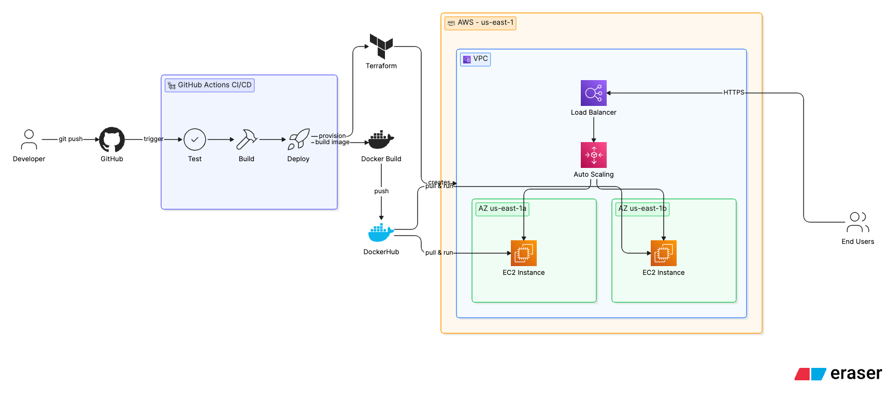

# Laravel DevOps Assessment

Production-grade Laravel deployment on AWS using Docker, EC2 Auto Scaling Group, Application Load Balancer, GitHub Actions CI/CD, and CloudWatch monitoring.

---

# Table of Contents

* Overview
* Architecture Diagram
* Tech Stack
* Infrastructure Components
* CI/CD Pipeline
* Deployment Flow
* AWS Architecture
* Monitoring & Logging
* Zero Downtime Deployment
* Rollback Strategy
* Auto Scaling Strategy
* Setup Instructions
* Screenshots
* Security Considerations
* Cost Optimization
* Future Improvements

---

# Overview

This project demonstrates a production-ready Laravel deployment architecture that satisfies the DevOps Assessment requirements:

* Automated CI/CD pipeline
* Dockerized Laravel application
* Application Load Balancer
* Auto Scaling Group
* Health checks
* Zero downtime deployment
* CloudWatch monitoring
* Infrastructure as Code

---

# Architecture Diagram



---

# Tech Stack

| Component              | Technology         |
| ---------------------- | ------------------ |
| Source Control         | GitHub             |
| CI/CD                  | GitHub Actions     |
| Containerization       | Docker             |
| Web Server             | Nginx              |
| Application Runtime    | PHP-FPM            |
| Cloud Provider         | AWS                |
| Compute                | EC2                |
| Load Balancing         | ALB                |
| Scaling                | Auto Scaling Group |
| Monitoring             | CloudWatch         |
| Infrastructure as Code | Terraform          |

---

# Infrastructure Components

* Application Load Balancer
* Auto Scaling Group
* Multiple EC2 Instances
* Docker Containers
* CloudWatch Monitoring
* Security Groups

---

# CI/CD Pipeline

Pipeline Trigger:

```text
Push → main branch
```

Pipeline Stages:

1. Checkout Code
2. Build Docker Image
3. Run Laravel Validation
4. Push Image
5. Deploy to EC2
6. Health Check Validation
7. Complete Deployment

---

# Deployment Flow

```text
Developer
    ↓
GitHub Repository
    ↓
GitHub Actions
    ↓
Docker Build
    ↓
Docker Registry
    ↓
AWS EC2 Instances
    ↓
Health Check
    ↓
Traffic Switch
```

---

# AWS Architecture

Application traffic enters through:

Internet
↓
Application Load Balancer
↓
Auto Scaling Group
↓
EC2 Instances
↓
Docker Containers

Benefits:

* High Availability
* Fault Tolerance
* Scalability
* Automated Recovery

---

# Monitoring & Logging

CloudWatch is used for:

* CPU Utilization
* Memory Monitoring
* Container Logs
* Application Logs
* Deployment Visibility

---

# Zero Downtime Deployment

Deployment Process:

1. Pull latest image
2. Start new container
3. Run health checks
4. Register healthy target
5. Remove old container
6. Continue serving traffic

No interruption occurs for users.

---

# Rollback Strategy

If deployment fails:

```bash
docker ps -a

docker stop current

docker run previous-image
```

Rollback Steps:

1. Detect failed deployment
2. Stop unhealthy container
3. Deploy previous stable image
4. Verify health checks

---

# Auto Scaling Strategy

Scale Out:

* CPU > 70%
* Add EC2 Instance

Scale In:

* CPU < 30%
* Remove EC2 Instance

Benefits:

* Cost Optimization
* High Availability
* Traffic Burst Handling

---

# Setup Instructions

## Clone Repository

```bash
git clone https://github.com/ShwetaBharambe21/laravel-app-assessment.git

cd laravel-app-assessment
```

## Build Container

```bash
docker build -t laravel-app .
```

## Run Container

```bash
docker run -d -p 80:80 laravel-app
```

## Verify Application

```bash
curl localhost
```

---

# Screenshots

## GitHub Actions


## Running Application


---

# Security Considerations

* Least Privilege IAM
* Restricted Security Groups
* Docker Image Hardening
* Secrets via GitHub Secrets
* Health Check Protection

---

# Cost Optimization

* Auto Scaling
* Right Sized EC2 Instances
* Docker Layer Caching
* CloudWatch Log Retention

---

# Future Improvements

* Blue/Green Deployments
* Automated Rollbacks
* Redis Integration
* HTTPS with ACM
* WAF Integration
* Multi-Region Architecture

---

# Author

Shweta Bharambe

GitHub:
https://github.com/ShwetaBharambe21
